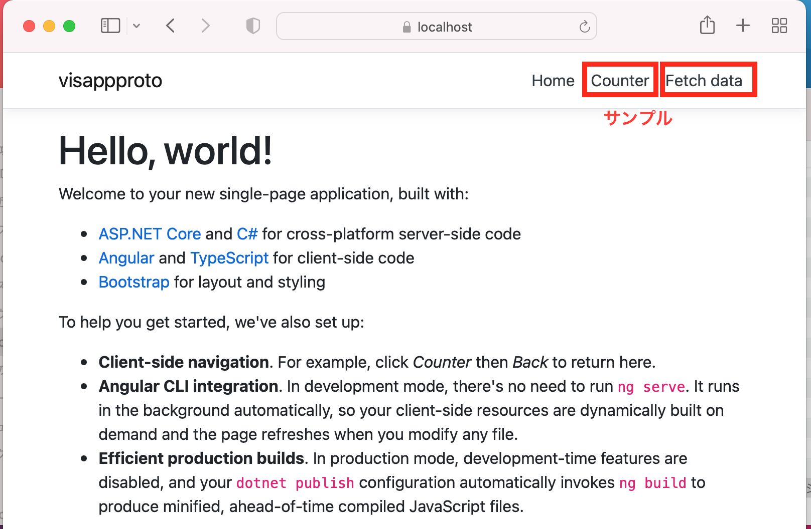
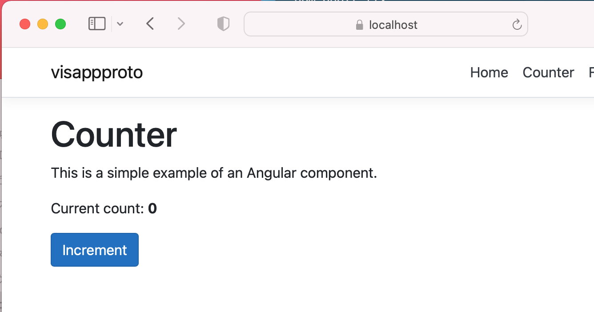
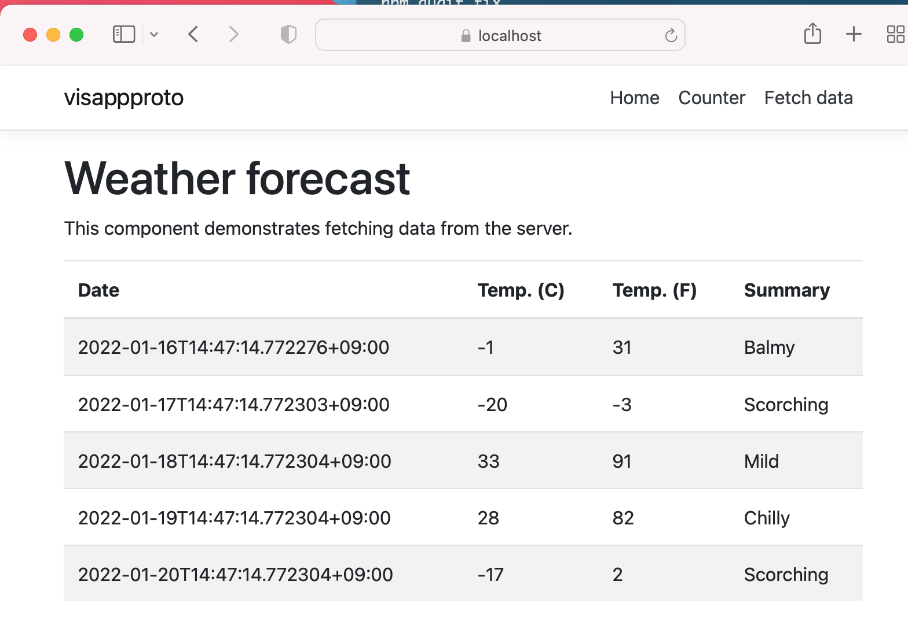
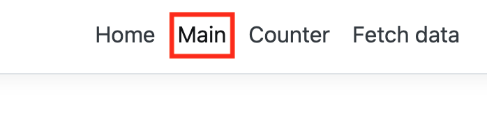
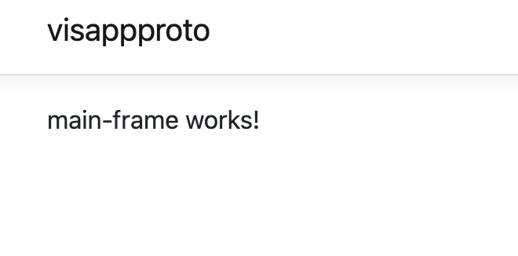
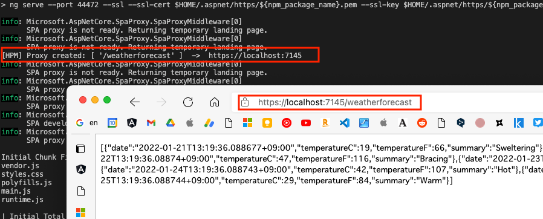
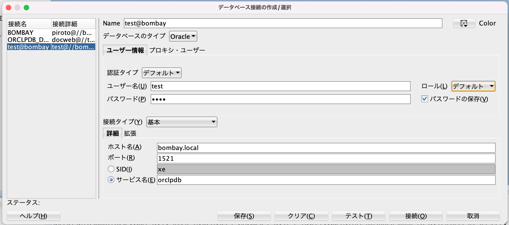
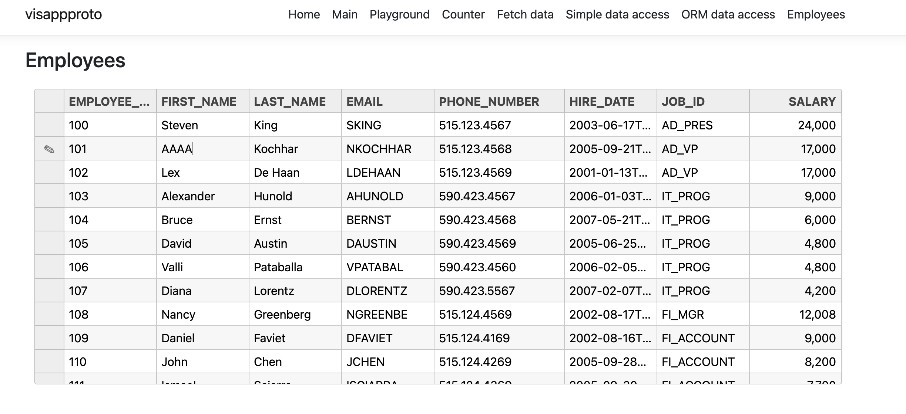

Ctrl + Shift + v でプレビュー表示

# visappproto
web application prototype

# 準備
## git clone
git clone https://github.com/pppiroto/visappproto.git
- 本プロジェクト
```
$ cd ClientApp
$ npm install
```

## .NET Core 6.0
https://dotnet.microsoft.com/en-us/download/dotnet/3.1
- 上記から入手しインストール

- https://qiita.com/uikou/items/40085758a596f87ecbf7

## NPM
### Mac
- Homebrew インストール 
```
/usr/bin/ruby -e "$(curl -fsSL https://raw.githubusercontent.com/Homebrew/install/master/install)"
```
- nodebrew インストール
```
brew install nodebrew
```
- nodebrew にパスを通す
```
echo 'export PATH=$HOME/.nodebrew/current/bin:$PATH' >> ~/.bash_profile
```
- 最新バージョンをインストール
```
nodebrew install-binary latest
```
### Windows
- nvm-windows
https://blog.clock-up.jp/entry/2018/02/10/nodejs-manager-on-windows
- インストーラーのDownload (nvm-setup.zip) 解凍してインストール
https://github.com/coreybutler/nvm-windows/releases

## Angular
- https://angular.jp/
- dotnet new angular でプロジェクトにAngular CLI(ng)がインストールされるので、それを使用する場合
```
npm run ng --version
```
- Angular CLI をグローバルにインストール
```
$ npm install -g @angular/cli@12.2.2
```

### Build / Run
- ClinentApp/dist が生成される
```
$ ng build
$ ng serve
```

### E2Eテスト
- ng e2e
[Protractor](http://www.protractortest.org/)を使用したエンドツーエンドテスト

### Service
- https://angular.jp/tutorial/toh-pt4

```
$ ng g service services/Employee
```

# .NET Core テンプレート
- [テンプレート](https://docs.microsoft.com/ja-jp/dotnet/core/tools/dotnet-new-sdk-templates)

## ASP.Net with Angular
https://docs.microsoft.com/ja-jp/dotnet/core/tools/dotnet-new-sdk-templates#spa

- カレントディレクトリにプロジェクトを生成
```
$ dotnet new angular -o visappproto
```
- テストプロジェクトの作成
```
$ dotnet new xunit -o visappproto_test
```

- ソリューションの作成とプロジェクトの追加、テストプロジェクトに参照の追加
```
$ dotnet new sln -o .
$ dotnet sln add visappproto
$ dotnet sln add visappproto_test
$ dotnet add ./visappproto_test/visappproto_test.csproj reference ./visappproto/visappproto.csproj 
```

## 実行(Hello world と サンプル)
```
$ dotnet watch run
```
- https://localhost:5001/



- Angular : ClinentApp/src/app/counter Sample



- Angular : ClientApp/src/app/fetch-data Sample
- ASP.NET Core : Controllers/WeatherForcastController.cs



# 開発
```
$ cd ClientApp/src/app
```
## ng generate サブコマンド
| 要素 | コマンド |
----|---- 
|モジュール|ng g moduole {{name}}|
|コンポーネント|ng g component {{name}}|
|ディレクティブ|ng g directive {{name}}|
|パイプ|ng g pipe {{name}}|
|サービス|ng g service {{name}}|
|ガード|ng g guard {{name}}|
|クラス|ng g class {{name}}|
|インターフェース|ng g interface {{name}}|
|列挙|ng g enum {{name}}|

## component 追加
- main-frame コンポーネントを追加
```
$ cd ClientApp
$ ng g component components/main-frame --module=app.module
CREATE src/app/components/main-frame/main-frame.component.css (0 bytes)
CREATE src/app/components/main-frame/main-frame.component.html (25 bytes)
CREATE src/app/components/main-frame/main-frame.component.spec.ts (650 bytes)
CREATE src/app/components/main-frame/main-frame.component.ts (284 bytes)
UPDATE src/app/app.module.ts (1267 bytes)
```
- app.module.ts に参照が追記される
- RouteModule.forRoot に追記
```
  imports: [
        ：
    RouterModule.forRoot([
        ：
      { path: 'main', component: MainFrameComponent },
    ])
  ],
  ```

  - nav-menu.component.html にリンクを追加
  ```
            <li class="nav-item" [routerLinkActive]="['link-active']">
            <a class="nav-link text-dark" [routerLink]="['/main']"
              > Main</a
            >
          </li>
  ```

- Home画面のメニューにMainを追加



- Mainクリックで作成したコンポーネント画面に遷移




# Wijimo
- https://www.grapecity.co.jp/developer/wijmo?utm_medium=link&utm_source=demo-wijm

## NPM によるインストール(Angularコンポーネント)
- https://demo.grapecity.com/wijmo/docs/GettingStarted/Angular-Components
- https://demo.grapecity.com/wijmo/docs/GettingStarted/Referencing-Wijmo-NPM

```
$ cd ClientApp
$ npm install @grapecity/wijmo.angular2.all
```

## VS Code 用 デザイナ (Wijmo Designer)
- https://marketplace.visualstudio.com/items?itemName=GrapeCityinc.gc-wijmo-designer

<video controls="controls" width="600">
  <source src="./readme_images/06_wijmo_component.mov">
</video>

## Demo
- https://demo.grapecity.com/wijmo/demos/

# ASP.NET Core
- [チュートリアル](https://docs.microsoft.com/ja-jp/aspnet/core/tutorials/first-web-api?view=aspnetcore-6.0&tabs=visual-studio)

- [サンプルのダウンロード](https://docs.microsoft.com/ja-jp/aspnet/core/introduction-to-aspnet-core?view=aspnetcore-6.0#how-to-download-a-sample)

## コントローラー
- https://docs.microsoft.com/ja-jp/aspnet/mvc/overview/older-versions-1/controllers-and-routing/aspnet-mvc-controllers-overview-cs
- クラス名は「Controler」で終わらなければならない
- dotnet watch run で起動時、Web API用のポートが用意される(proxy.conf.js)


### ルーティング
- [ルーティング](https://docs.microsoft.com/ja-jp/aspnet/core/mvc/controllers/routing?view=aspnetcore-6.0)
### Action
- Progmra.cs 参照

### ユニットテスト
- [コントローラーのユニットテスト](https://docs.microsoft.com/ja-jp/aspnet/core/mvc/controllers/testing?view=aspnetcore-6.0)
- [xUnit](https://docs.microsoft.com/ja-jp/dotnet/core/testing/unit-testing-with-dotnet-test)

- [Fact] 属性で、テスト ランナーによって実行されるテスト メソッドを宣言
- テストプロジェクトフォルダから、以下を実行
```
$ cd visappproto_test
$ dotnet test
```
- フィルタをかける
```
$ dotnet test --filter AutoCompleteControllerTest
```
#### Mock ライブラリの導入
```
$ dotnet add package Moq --version 4.16.1
```

# Data Access
## Oracle 19c
+ SQL Developer 接続
+ Connection文字列は、/Models/VisAppProtSettings.cs に記述したものをDI


## DataAccess Package
+ https://www.nuget.org/packages/Oracle.ManagedDataAccess.Core
```
$ dotnet add package Oracle.ManagedDataAccess.Core --version 3.21.50
```

## Oracle Data Providor直接利用
- /Controllers/SimpleDataAccessController.cs

# MySQL
```
$ dotnet add package MySql.Data --version 8.0.28
```

## OR Mapper(Dapper)
+ [概要](https://qiita.com/ikuosaito1989/items/f332863dfbe5f30fdf4a)
+ [QueryFirstチュートリアル](https://dapper-tutorial.net/queryfirst)
+ [応用](https://yanor.net/wiki/?dotNet/Dapper/%E5%BF%9C%E7%94%A8)
```
$ dotnet add package Dapper --version 2.0.123
```

### Sample
+ ClientApp/src/app/orm-data-access
+ Controllers/OrmDataAccessController.cs


# UI
## Bootstrap
- [Bootstrap](https://getbootstrap.jp/)

### ngx-bootstrap
- [ngx-bootstrap](https://valor-software.com/ngx-bootstrap/#/)
- [ngx-bootstrap npm](https://www.npmjs.com/package/ngx-bootstrap)
- Bootstrapのラッパー
- Bootstrapの機能をコンポーネント、ディレクティブとして呼び出すことができる
```
$ ng add ngx-bootstrap
```


## Grid
- [FrexGrid](https://demo.grapecity.com/wijmo/api/modules/wijmo_grid.html)
- visappproto/ClientApp/src/app/components/employees



- [無限スクロール](https://demo.grapecity.com/wijmo/demos/Grid/Data-binding/InfiniteScrolling/angular)
- [フォーム](https://demo.grapecity.com/wijmo/demos/Undo/UndoStack/angular)


# Angular Sample App
- https://angular.jp/start
- [StackBlitzサンプルプロジェクト](https://angular.jp/generated/live-examples/getting-started-v0/stackblitz.html)

# Deploy
```
$ dotnet publish
```
## トラブルシュート
### error : initial exceeded maximum budget
- EXEC : error : initial exceeded maximum budget. Budget 1.00 MB was not met by 171.82 kB with a total of 1.17 MB.
- angular.json
```
"budgets": [
  {
    "type": "initial",
    "maximumWarning": "5mb",
    "maximumError": "10mb"
  },
```              


